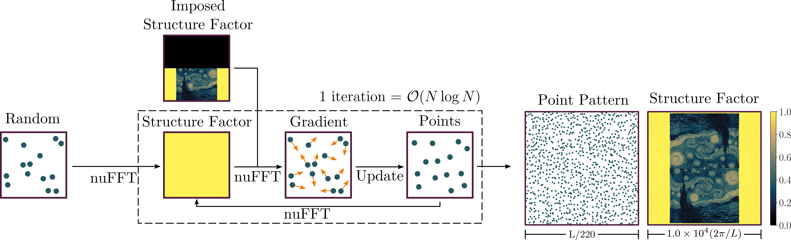
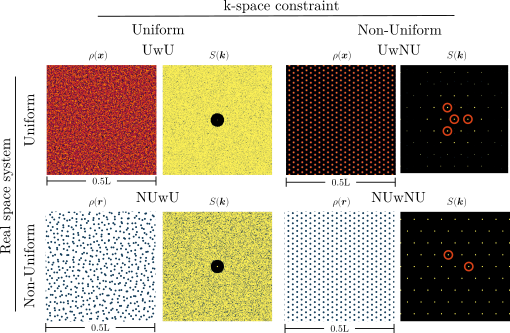

# FReSCo
Fast Reciprocal Space Correlator

FReSCo is a Python package (written in c++ and wrapped with cython) to impose reciprocal-space (aka Fourier-space, k-space) constraints on a real space system in 1d, 2d, or 3d. For example, starting from a random point pattern, we can adjust the positions of the points to find a point pattern whose structure factor looks like Van Gogh's Starry Night:



This is achievable in quasilinear time largely due to the FINUFFT package https://finufft.readthedocs.io/en/latest/index.html. We borrow their formalism to describe our real- and reciprocal-spaces as 'uniform' (i.e. a grid of intensity values) and 'non-uniform' (a set of point coordinates in continuous space).
Below, we show our algorithm's handling of all permutations of real- and reciprocal-spaces.
For uniform reciprocal-space examples, the imposed structure factor was $S(k)=0$ for a circle centered at $k=0$.
For non-uniform reciprocal-space examples, peaks were imposed in the structure factor at the locations marked with red circles.
The structure factors depicted below are the measured structure factors of the resulting systems.



We recommend reading our preprint *Fast Generation of Spectrally-Shaped Disorder* at https://arxiv.org/abs/2305.15693 for more in-depth details of our algorithm. We also have a video submission to the DSOFT Gallery of Soft Matter [here](https://www.youtube.com/watch?v=A-CNb0IMXQw).

## Installation - Docker

We recommend installing using a Docker container. In particular, it is by far the easiest solution on MacOS.
The Dockerfile contains the minimal setup for the container. To build a container called frescontainer with a cloned, simply run

```bash
./docker_build.sh
```

This may take a few minutes on the first build.
Then, either run

```bash
./docker_starter.sh
```

to enter the container and run code directly from it, or run

```bash
./docker_starter.sh my_command
```

to run commands in the container from the outside.
By default, docker_build mounts the examples directory into the docker environment so that outputs are easily accessible from the outside.

## Installation - conda

If instead you prefer using a conda environment, follow these steps after downloading FReSCo.

### Installation of FINUFFT dependency

If you have not already installed version 2.2 of FINUFFT, you can do so by following the instructions 
at https://finufft.readthedocs.io/en/latest/install.html.

On Linux, in short, use the following commands while making sure to replace `/path/to/FReSCo/` in the first cmake 
command with the actual path to your FReSCo directory on your machine:

```bash
git clone https://github.com/flatironinstitute/finufft.git
git checkout tags/v2.2.0 -b v2.2.0
cd finufft
mkdir build
cd build
cmake .. -D FINUFFT_BUILD_TESTS=ON --install-prefix /path/to/FReSCo/finufft
cmake --build . -j
ctest
cmake --install .
```

On Macs (for both Intel and Apple silicon), we recommend using
[homebrew](https://brew.sh) to install the necessary software
and libraries for compilation. Once homebrew is installed, use

```bash
brew install gcc@14 cmake fftw pkg-config
```

Among other things, this will install version 14 of gcc and give you
access to the `gcc-14` and `g++-14` commands. Be aware that Apple
provides its own compilers under the commands `gcc` and `g++` which,
however, just run clang and not the GNU compilers. Since we do not
support using the clang compilers at the moment, we have to make
sure that the compilers installed by homebrew are used in the
following. If you installed a different version of gcc, make sure to
replace the `gcc-14` and `g++-14` parts accordingly.

After installing the necessary software, you can install FINUFFT by following the
commands above. Only make sure that cmake finds the correct GNU compilers and the fftw library:

```bash
cmake .. -DFINUFFT_BUILD_TESTS=ON -DCMAKE_C_COMPILER=gcc-14 -DCMAKE_CXX_COMPILER=g++-14 -DCMAKE_PREFIX_PATH=$(brew --prefix fftw) --install-prefix /path/to/FReSCo/finufft
```

Again, make sure to replace `/path/to/FReSCo/` by the actual path to your FReSCo directory in this command.

### Installation of FReSCo

Navigate to the FReSCo directory:

```bash
cd /path/to/FReSCo
```

Create a new conda environment named `fresco` from `fresco.yml`, which will install all packages using the channel `conda-forge`.

```bash
conda env create --name fresco --file=fresco.yml
```

Activate your new conda environment. After this step your terminal should lead with the environment name (here we made it `fresco`):

```bash
conda activate fresco
```

If you installed finufft in a different location than `/path/to/FReSCo/finufft` (because you modified the installation 
prefix), you will need to edit the `finufft_dir` variable in `setup.py` before proceeding. While in the FReSCo 
directory, open `setup.py` in a text editor and find the variable `finufft_dir=/path/to/finufft`. Edit it to be the path 
to your finufft directory. Save and exit the text editor.

Run `setup.py` as follows:

```bash
python setup.py build_ext -i
```

On MacOs, set the deployment target to your current MacOs version to avoid errors (the Gnu compilers and libraries from 
homebrew are detected within the Python script):

```bash
MACOSX_DEPLOYMENT_TARGET=$(sw_vers -productVersion) python setup.py build_ext -i
```

(If at any point you would like to rebuild the package from scratch, please run `rm -r build/ cythonize.dat` before 
running `setup` using the previous line again.)

If you are using Jupyter notebooks, create a kernel from the conda environment as follows:

```bash
python -m ipykernel install --user --name=fresco
```

Optional packages for some examples:

```
pip install jscatter
```

## Usage

Remember to add `:/path/to/FReSCo` to your `PYTHONPATH` environment in `~/.bashrc` and either run `source ~/.bashrc`
 or restart your terminal update with these changes.

If you are using Jupyter notebooks, you will also have to add it to your `JUPYTER_PATH` in the same way. 

Our 'potentials' ('loss functions' if that's more your persuasion) can be imported by name:

```python
from fresco.potentials import UwU, UwNU, NUwU, NUwNU
```

Similarly, our provided minimizers can also be imported

```python
from fresco.optimize import LBFGS_CPP, ModifiedFireCPP
```

Each of these are classes that need to be instantiated. See examples for demonstrations.

## References and Citing

If you use FReSCo in your research, please cite the following paper, in which we describe the algorithm

> *Fast Generation of Spectrally-Shaped Disorder*
> 
> Aaron Shih, Mathias Casiulis, and Stefano Martiniani
>
> Physical Review E 110 (3), 034122 (2024)
> 
> https://journals.aps.org/pre/abstract/10.1103/PhysRevE.110.034122
> 
> https://arxiv.org/abs/2305.15693

Our algorithm utlizes the Flatiron Nonuniform Fast Fourier Transform

https://finufft.readthedocs.io/en/latest/refs.html

> A parallel non-uniform fast Fourier transform library based on an “exponential of semicircle” kernel. A. H. Barnett, J. F. Magland, and L. af Klinteberg. SIAM J. Sci. Comput. 41(5), C479-C504 (2019).
>
> https://arxiv.org/abs/1808.06736
> 
> Aliasing error of the exp kernel in the nonuniform fast Fourier transform. A. H. Barnett. Appl. Comput. Harmon. Anal. 51, 1-16 (2021).
>
> https://arxiv.org/abs/2001.09405


